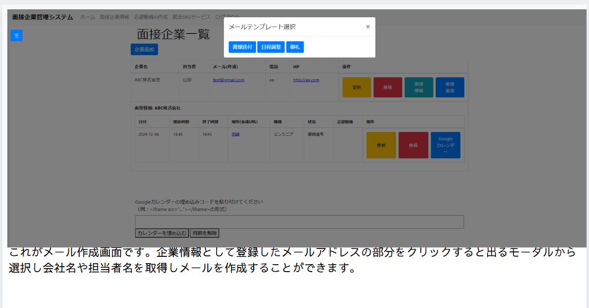

# JobManagement

## 概要
このプロジェクトは、就活をする上で情報整理や企業とのやり取りやスケジュール管理を利便化させることを目的としたものです。

## 機能一覧
- ユーザー認証機能（パスワードリセット含む）
- お気に入り求人保存機能
- TODOリスト
- 面接企業情報追加
- テンプレートGmail作成機能
- スケジュール管理（Googleカレンダー利用）
- 志望動機AI作成
- 情報交換SNS（外部で作成）

# デモ画像一覧

以下はプロジェクトで使用されるデモ画像の一覧です。

## **1. アカウント作成画面**

---

## **2. ログイン画面**

---

## **3. パスワードリセット**

---

## **4. ホーム画面**

---

## **5. 情報表示画面1**

---

## **6. 情報表示画面2**

---

## **7. メール作成画面**

---
## **8. 志望動機AI作成画面**

---

## **9. 外部作成SNSユーザー認証画面**

## **10. 外部作成SMSメイン画面**

